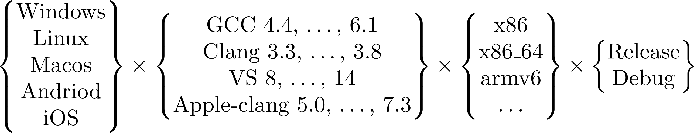
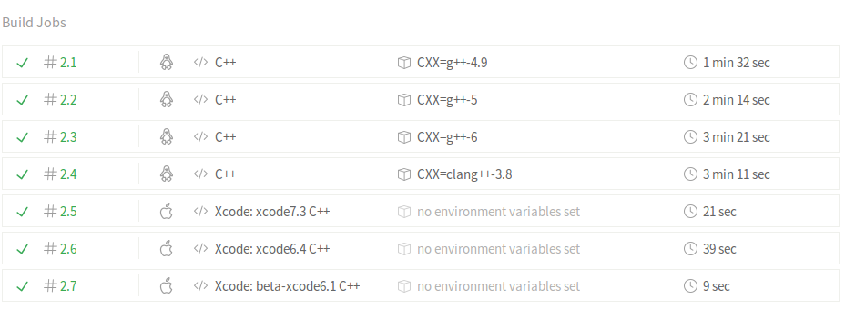
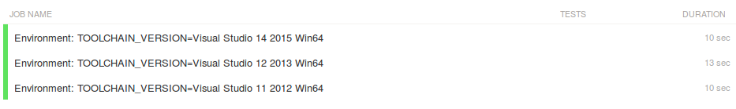
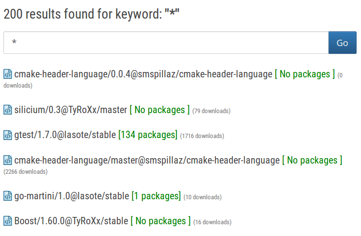
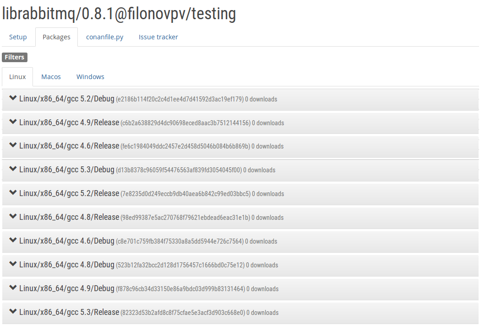
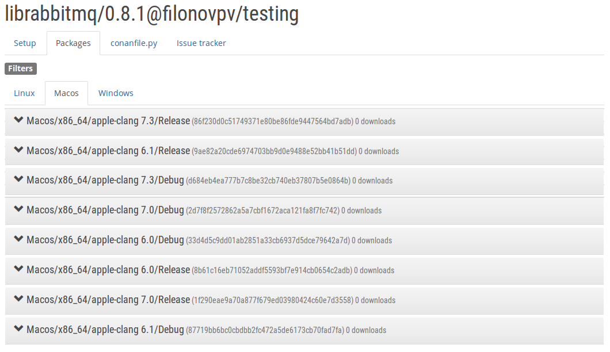
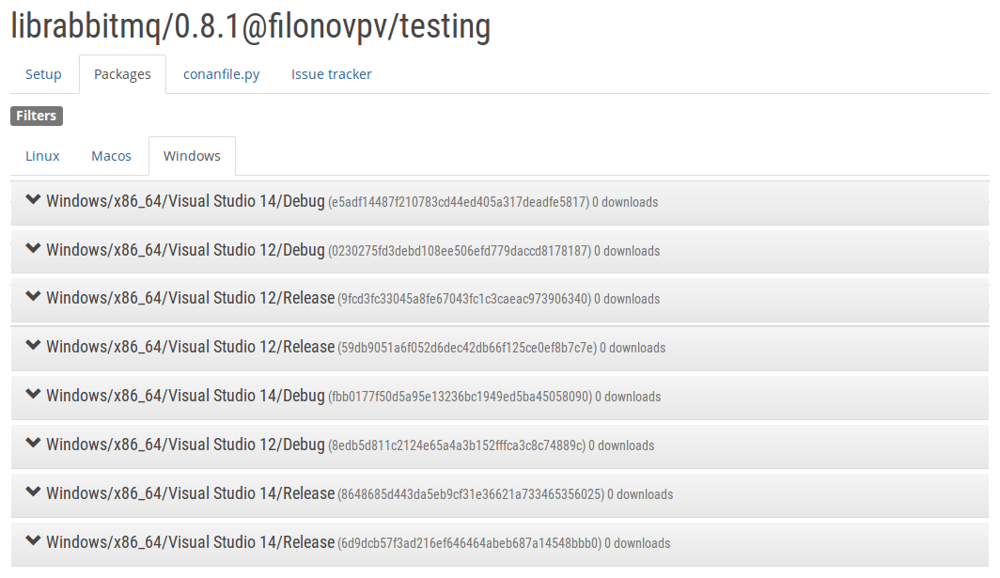

## Divide and manage with Conan.io

Pavel.Filonov@kaspersky.com


## C++ provides control

Example: parameter passing <!-- .element: class="fragment" -->
 1. f(X) <!-- .element: class="fragment" -->
 2. f(X&) <!-- .element: class="fragment" -->
 3. f(const X&) <!-- .element: class="fragment" -->
 4. f(X*) <!-- .element: class="fragment" -->
 5. f(const X*) <!-- .element: class="fragment" -->
 6. f(X&&) <!-- .element: class="fragment" -->
 7. template&lt;class T&gt; f(T&&) <!-- .element: class="fragment" -->
 8. f(owner&lt;X*&gt;) <!-- .element: class="fragment" -->
 9. f(not_null&lt;X*&gt;) <!-- .element: class="fragment" -->
 10. f(unique_ptr&lt;X&gt;) <!-- .element: class="fragment" -->
 11. f(shared_ptr&lt;X&gt;) <!-- .element: class="fragment" -->


## C++ provides portability


<!-- .element: class="fragment" -->

But how we could build all of this!
<!-- .element: class="fragment" -->


## C++ build tools

* CMake
* qmake
* bazel
* ninja
* meson
* maiken
* Scons
* ...

Ok. But who will manage your dependencies?
<!-- .element: class="fragment" -->


## C++ dependency managers

* Linux 
    * apt, yum, portage, pacman, ...
* Macos 
    * MacPorts, Fink, Homebrew, ...
* Windows
    * Nuget, Chocolatey
* Cross-plarform
    * cpm, hunter, ExternalProject_Add
    * &lt;self-written scripts on python, perl, bash, cmake&gt;
    * <!-- .element: class="fragment" --> ~~biicode~~ 
    * conan <!-- .element: class="fragment" -->


## "Hello, world" in TDD style

hello.h
```cpp
#ifndef HELLO_H
#define HELLO_H

#include <ostream>

std::ostream& hello(std::ostream&);

#endif
```

test_hello.cpp
```cpp
void test_hello() {
    std::stringstream ss;
    hello(ss);
    assert("Hello, world" == ss.str());
}
```


## Build configuration
CMakeLists.txt
```cmake
cmake_minimum_required(VERSION 2.8.12)
project(hello CXX)
set(${PROJECT_NAME}_SOURCES
    ${CMAKE_SOURCE_DIR}/src/hello.cpp
)
set(${PROJECT_NAME}_HEADERS
    ${CMAKE_SOURCE_DIR}/include/hello.h
)
include_directories(include)
add_executable(${PROJECT_NAME}
    ${CMAKE_SOURCE_DIR}/src/main.cpp
    ${${PROJECT_NAME}_SOURCES}
    ${${PROJECT_NAME}_HEADERS}
)
enable_testing()
add_subdirectory(test)
```


## Travis CI configuration
.travis.yml
```
sudo: required
dist: trusty

script:
  - mkdir build && cd build
  - cmake ..
  - cmake --build .
  - ctest

matrix:
  include:
    - os: linux
      addons:
        apt:
          sources:
            - ubuntu-toolchain-r-test
          packages:
            - g++-4.9
      env: CXX=g++-4.9
    - os: linux
      addons:
        apt:
          sources:
            - ubuntu-toolchain-r-test
          packages:
            - g++-5
      env: CXX=g++-5
    - os: linux
      addons:
        apt:
          sources:
            - ubuntu-toolchain-r-test
          packages:
            - g++-6
      env: CXX=g++-6
    - os: linux
      addons:
        apt:
          sources:
            - ubuntu-toolchain-r-test
            - llvm-toolchain-trusty-3.8
          packages:
            - g++-6
            - clang-3.8
      env: CXX=clang++-3.8
    - os: osx
      osx_image: xcode7.3
    - os: osx
      osx_image: xcode6.4
    - os: osx
      osx_image: beta-xcode6.1
```


## Profit!




## Appveyor configuration

appveyor.yml
```
build:

build_script:
  - mkdir build && cd build
  - cmake -G "%TOOLCHAIN_VERSION%" ..
  - cmake --build . --config release

test_script:
- cmd: ctest -C release -VV
environment:
  matrix:
    - TOOLCHAIN_VERSION: Visual Studio 14 2015
    - TOOLCHAIN_VERSION: Visual Studio 12 2013
    - TOOLCHAIN_VERSION: Visual Studio 11 2012

```


## We need more builds




### Now we want to use GoogleTest

```cpp
#include <sstream>
#include <iostream>

#include <gtest/gtest.h>

#include <hello.h>

TEST(hello, simple) {
    std::stringstream ss;
    hello(ss);
    ASSERT_EQ("Hello, world", ss.str());
}
```

But how build it on CI? <!-- .element: class="fragment" -->


## Here comes conan

```
pip install conan
```

conanfile.txt
```
[requires]
gtest/1.7.0@lasote/stable

[generators]
cmake
```
CMakeLists.txt
```
include(${CMAKE_BINARY_DIR}/conanbuildinfo.cmake)
conan_basic_setup()

target_link_libraries(${PROJECT_NAME} ${CONAN_LIBS})
```


## Install dependencies

```bash
$conan install
```
```
Requirements
    gtest/1.7.0@lasote/stable from conan.io
Packages
    gtest/1.7.0@lasote/stable:ee666ea2ce
gtest/1.7.0@lasote/stable: Installing package ee666ea2ce
gtest/1.7.0@lasote/stable: Looking for package ee666ea2ce in remote 'conan.io' 
Downloading conan_package.tgz
[==================================================]                  
Downloading conanmanifest.txt
[==================================================]                  
Downloading conaninfo.txt
[==================================================]                  
gtest/1.7.0@lasote/stable: Package installed ee666ea2ce
PROJECT: Generated cmake created conanbuildinfo.cmake
PROJECT: Generated conaninfo.txt
```


## If no binary package found
```
$conan install --build=missing
```
```
gtest/1.7.0: WARN: Binary for ad55876aa not in remote: Package not found!
gtest/1.7.0: Building your package in ~/.conan/data/gtest/1.7.0/lasote/stable/build/ad55876aa
gtest/1.7.0: Configuring sources in ~/.conan/data/gtest/1.7.0/lasote/stable/source
[==================================================]                  
Unzipping 4.8 MB, this can take a while
gtest/1.7.0: Copying sources to build folder
gtest/1.7.0: Generated cmake created conanbuildinfo.cmake
-- The C compiler identification is GNU 6.1.1
-- The CXX compiler identification is GNU 6.1.1
...
gtest/1.7.0 package(): Copied 20 '.h' files
gtest/1.7.0 package(): Copied 2 '.so' files: libgtest_main.so, libgtest.so
gtest/1.7.0: Package 'ad55876aa' created
PROJECT: Generated cmake created conanbuildinfo.cmake
PROJECT: Generated conaninfo.txt

```


## Using conan on CI
.travis.yml
```yml
before_install:
  - sudo pip install conan
install:
  - conan install --build=missing
```
appveyor.yml
```yml
install:
  - set PATH=%PATH%;%PYTHON%/Scripts/
  - pip.exe install conan # It install conan too
  - conan install --build=missing
```


## Conan repository package list




## How to build own package

conanfile.py
```python
class LibrabbitmqConan(ConanFile):
  name = "librabbitmq"
  version = "0.8.1"
  
  def source(self):
    self.run("git clone https://github.com/alanxz/rabbitmq-c.git")
  
  def build(self):
    cmake = CMake(self.settings)
    self.run("cmake -DENABLE_SSL_SUPPORT=OFF "
             "%s/rabbitmq-c %s" % (self.conanfile_directory,
                                   cmake.command_line))
    self.run("cmake --build . %s" % cmake.build_config)
  
  def package(self):
    self.copy("*.h", dst="include", src="rabbitmq-c/librabbitmq")
    self.copy("*.lib", dst="lib", src="librabbitmq")
    self.copy("*.dll", dst="lib", src="librabbitmq")
    self.copy("*.a", dst="lib", src="librabbitmq")
    self.copy("*.so.*", dst="lib", src="librabbitmq")

  def package_info(self):
    self.cpp_info.libs = ["rabbitmq"]
```
```
    conan export demo/testing
```


## Conan private repository
Get sources
```sh
$ git clone https://github.com/conan-io/conan.git
$ cd conan
$ git checkout master
$ pip install -r conans/requirements.txt
$ pip install -r conans/requirements_server.txt
$ pip install gunicorn
```

Run server
```sh
gunicorn -b 0.0.0.0:9300 -w 4 -t 120 \
    conans.server.server_launcher:app
```

Upload packages
```sh
$ conan upload librabbitmq/0.8.1@demo/testing
```


## Conan build package tools

build.py
```python
from conan.packager import ConanMultiPackager

if __name__ == "__main__":
    builder = ConanMultiPackager()
    builder.add_common_builds(pure_c=True)
    builder.run()
```


## Conan build package tools
.travis.yml
```yaml
os: linux
services:
   - docker
sudo: required
language: python
env:
  matrix:
    - CONAN_GCC_VERSIONS=4.6 CONAN_USE_DOCKER=1
    - CONAN_GCC_VERSIONS=4.8 CONAN_USE_DOCKER=1
    - CONAN_GCC_VERSIONS=4.9 CONAN_USE_DOCKER=1 
    - CONAN_GCC_VERSIONS=5.2 CONAN_USE_DOCKER=1
    - CONAN_GCC_VERSIONS=5.3 CONAN_USE_DOCKER=1

  global:
    - CONAN_UPLOAD=1
    - CONAN_REFERENCE="librabbitmq/0.8.1"
    - CONAN_USERNAME="filonovpv"
    - CONAN_CHANNEL="testing"
    - CONAN_TOTAL_PAGES=1
    - CONAN_CURRENT_PAGE=1

matrix:
   include:
       - os: osx 
         osx_image: xcode7.3 # apple-clang 7.3
         language: generic
         env:
       - os: osx 
         osx_image: xcode7.1 # apple-clang 7.0
         language: generic
         env:
       - os: osx
         osx_image: xcode6.4 # apple-clang 6.1
         language: generic
         env:
       - os: osx 
         osx_image: xcode6.2 # apple-clang 6.0
         language: generic
         env:

install:
  - ./.travis/install.sh
script:
- ./.travis/run.sh
```


## Conan build package tools
appveyor.yml
```yaml
build: false
environment:
    PYTHON: "C:\\Python27"
    PYTHON_VERSION: "2.7.8"
    PYTHON_ARCH: "32"
    
    CONAN_UPLOAD: 1
    CONAN_REFERENCE: "librabbitmq/0.8.1"
    CONAN_USERNAME: "filonovpv"
    CONAN_CHANNEL: "testing"
    CONAN_TOTAL_PAGES: 4
    
    matrix:
        - CONAN_CURRENT_PAGE: 1
        - CONAN_CURRENT_PAGE: 2  
        - CONAN_CURRENT_PAGE: 3
        - CONAN_CURRENT_PAGE: 4

install:
  # Workaround for CMake not wanting sh.exe on PATH for MinGW
  - set PATH=%PATH:C:\Program Files\Git\usr\bin;=%
  - set PATH=%PATH%;%PYTHON%/Scripts/
  - pip.exe install conan_package_tools # It install conan too
  - conan user # It creates the conan data directory

test_script:
- python build.py
```


## Created packages




## Created packages




## Created packages




## Conclusions

* Positive points <!-- .element: class="fragment" data-fragment-index="1"-->
  * build scripts on python <!-- .element: class="fragment" data-fragment-index="1"-->
  * public repository  <!-- .element: class="fragment" data-fragment-index="1"-->
  * private repository <!-- .element: class="fragment" data-fragment-index="1"-->
  * build matrix
* Negative points <!-- .element: class="fragment" data-fragment-index="2"-->
  * build scripts on python <!-- .element: class="fragment" data-fragment-index="2"-->
  * small number of packages in the official repository <!-- .element: class="fragment" data-fragment-index="2"-->
  * small amount of documentation


## References

1. Conan - C/C++ package manager - [Site](https://conan.io/), [Source](https://github.com/conan-io/conan)
2. conan.io c++ package manager demo with sfml - [Video](https://www.youtube.com/watch?v=RFjvz_Ppbv8)
3. CppCon 2014: Lightning Talks - Boris Kolpackov "C++ Package Manager" - [Video](https://www.youtube.com/watch?v=nshzjMDD79w)
4. Diego Rodriguez-Losada: Biicode, a C/C++ dependency manager with a hosting service  -[Video](https://www.youtube.com/watch?v=bX7gI6eA_AM&list=PL_AKIMJc4roX665MVPoqbzHVZFMBzgytT&index=7)
5. Diego Rodriguez-Losada: Why in heaven is there no dependency management for C++? - [Video](https://www.youtube.com/watch?v=67Am8Z6irjA)
6. Arne Mertz, Using Conan for Third Party Libraries - [Blogpost](http://arne-mertz.de/2016/08/conan-for-third-party-libraries/?utm_content=buffer53cba&utm_medium=social&utm_source=twitter.com&utm_campaign=buffer)
7. Programming C++ With The 4 Cs: Clang, Cmake, Clion And Conan - [Blogpost](http://blog.conan.io/2016/05/10/Programming-C++-with-the-4-Cs-Clang,-CMake,-CLion-and-Conan.html)


## Thank you for your attention!

Contacts:
<table>
<tbody>
<tr><td>email</td><td>Pavel.Filonov@kaspersky.com</td></tr>
<tr><td>github</td><td><a href="https://github.com/sdukshis">sdukshis</a></td></tr>
<tr><td>twitter</td><td>@filonovpv</td></tr>
</tbody>
</table>